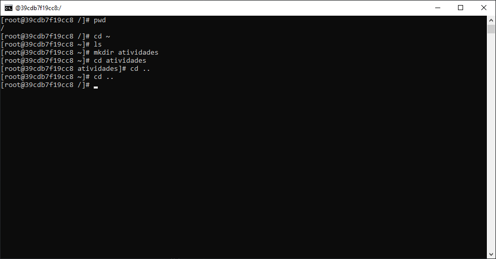
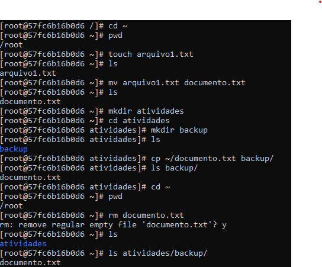
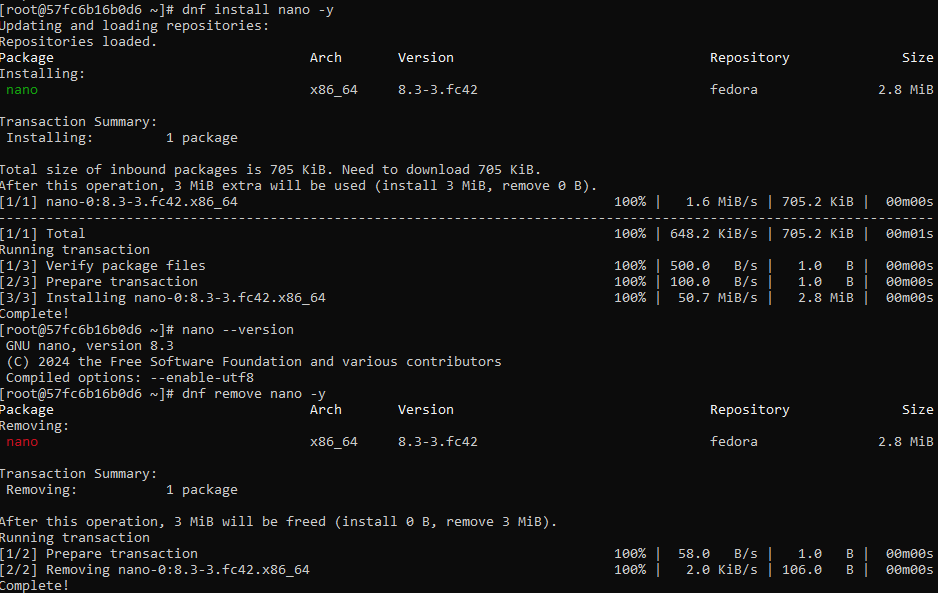
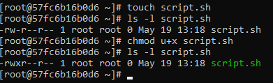
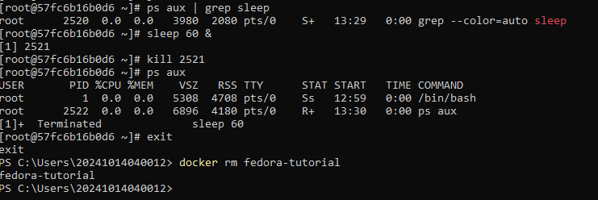

# Atividade 02 - Docker Linux

**Aluno:** Mateus Miranda de Oliveira

**Matrícula:** 20241014040012

**Data:** 19/05/2025

## Introdução

O objetivo do projeto é introduzir ao aluno um conjunto de comandos básicos do Linux (distro: Fedora) dentro de um container Docker.

## Relato

### 1. Navegação Básica

Exploração de comandos de diretório: navegação pelos diretórios, descobrir diretório atual e criação de novo diretório.

**Imagem**

### 2. Manipulação de Arquivos

Introdução aos comandos para criar, copiar, excluir e mover arquivos dentro de um diretório e entre diretórios.

**Imagem**

### 3. Gerenciamento de Pacotes

Instalar e remover pacotes com dnf (Dandified Yum).

**Imagem**

### 4. Permissões de Arquivos

Modificar e visualizar permissões de arquivos.

**Imagem**

### 5. Processos em Execução e Encerramento do Container

Monitorar e encerrar processos e container.

**Imagem**

## Conclusão

Neste exercício, aprendi sobre alguns comandos básicos do terminal do Linux, especialmente os que envolvem a manipulação de diretórios e arquivos, mas também outros como monitoramente de processos e gerenciamento de pacotes.

Houve uma pequena dificuldade num dado momento: alguns pacotes não estavam atualizados, o que retornou um ``bash: ps commando not found`` ao tentar executar o comando ``ps aux``. Com uma breve pesquisa na internet, descobri que poderia atualizar os pacotes com ``	
dnf install procps -y``, o que instalou o pacote **procps** e resolveu o meu problema.